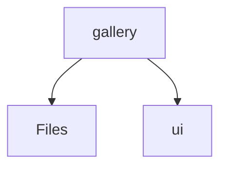

# 📁 Gallery Directory

[frontend](/frontend) > [src](/frontend/src) > [pages](/frontend/src/pages) > [gallery](/frontend/src/pages/gallery)

## 🎯 Purpose
A high-level module handling `gallery` logic within the Mavluda Beauty ecosystem. This directory adheres to our "Luxury Professional" architectural standards.

**FSD Layer:** Pages


## 🏗️ Architecture



## 📄 File Registry
| File Name | Type | Responsibility | Key Aliases Used |
|-----------|------|----------------|------------------|
| `gallery.component.html` | Template | Angular UI standalone component logic. | None |
| `gallery.component.scss` | Style | Angular UI standalone component logic. | None |
| `gallery.component.ts` | Component | Angular UI standalone component logic. | @entities/admin-settings, @entities/gallery, @angular/forms, @angular/core, @environments/environment, @shared/models, @shared/ui, @shared/lib, @shared/lib/object, @angular/common |
| `index.ts` | TypeScript | Provides localized typescript definitions. | None |

## 🔗 Dependencies
- `@angular/common`
- `@angular/core`
- `@angular/forms`
- `@entities/admin-settings`
- `@entities/gallery`
- `@environments/environment`
- `@shared/lib`
- `@shared/lib/object`
- `@shared/models`
- `@shared/ui`

## 🛠️ Usage
```typescript
// Architectural overview snippet
import { InternalLogic } from './internal-file';
// Ensure adherence to Hexagonal / FSD principles
```
