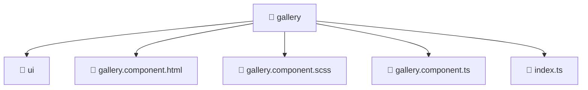

# 📁 Mavluda Beauty gallery

[frontend](/frontend) / [src](/frontend/src) / [pages](/frontend/src/pages) / [gallery](/frontend/src/pages/gallery)

## 🎯 Purpose
Delivering luxury-tier architectural components and high-performance logic for the **gallery** domain. This directory is a crucial part of the Mavluda Beauty full-stack ecosystem, ensuring seamless scalability, robust performance, and an elite digital experience.

> **FSD Layer**: `Pages` - Adhering to Feature Sliced Design principles.

## 🏗️ Architecture


## 📄 File Registry
| File Name | Type | Responsibility | Key Aliases Used |
|---|---|---|---|
| `gallery.component.html` | Component | Renders UI and handles user interaction. | N/A |
| `gallery.component.scss` | Component | Renders UI and handles user interaction. | N/A |
| `gallery.component.ts` | Component | Renders UI and handles user interaction. | `@angular/core, @angular/common, @angular/forms, @entities/gallery, @entities/admin-settings, @shared/models, @shared/ui, @shared/lib/object, @shared/lib, @environments/environment` |
| `index.ts` | TypeScript Logic | Core logic and utilities for this domain. | N/A |


## 🔗 Dependencies
**Path Aliases:**
- `@angular/core`
- `@angular/common`
- `@angular/forms`
- `@entities/gallery`
- `@entities/admin-settings`
- `@shared/models`
- `@shared/ui`
- `@shared/lib/object`
- `@shared/lib`
- `@environments/environment`


## 🛠️ Usage
```typescript
// Example integration for gallery
// Import capabilities from this directory to enrich your modules.
```
> This directory provides specialized logic tailored to the Mavluda Beauty standard.
