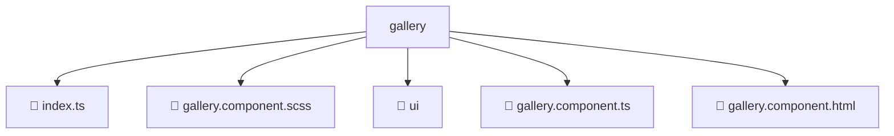

# 📂 GALLERY

> 💎 **Mavluda Beauty - Luxury Professional Architecture**

### 📍 Breadcrumb Navigation
`. > frontend > src > pages > gallery`

## 🎯 PURPOSE
This directory encapsulates `Pages` level functionality within the Mavluda Beauty ecosystem, ensuring proper separation of concerns and architectural transparency.

**FSD / Architecture Layer:** `Pages`

## 🏗️ ARCHITECTURE


## 📄 FILE REGISTRY

| Item Name | Type | Responsibility | Key Aliases Used |
|-----------|------|----------------|------------------|
| `📄 index.ts` | `.ts` | General functionality | `None` |
| `📄 gallery.component.scss` | `.scss` | Component logic | `None` |
| `📁 ui` | `Directory` | Subdirectory logic grouping | `None` |
| `📄 gallery.component.ts` | `.ts` | Component logic | `@shared/lib/object, @environments/environment, @angular/core, @shared/models, @entities/admin-settings, @angular/common, @angular/forms, @shared/lib, @shared/ui, @entities/gallery` |
| `📄 gallery.component.html` | `.html` | Component logic | `None` |

## 🔗 DEPENDENCIES
- `@shared/lib/object`
- `@environments/environment`
- `@angular/core`
- `@shared/models`
- `@entities/admin-settings`
- `@angular/common`
- `@angular/forms`
- `@shared/lib`
- `@shared/ui`
- `@entities/gallery`

## 🛠️ USAGE
```typescript
// Example usage context
import { ... } from './index';

// Integrate index logic into your feature.
```
