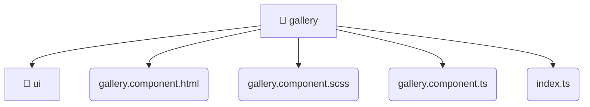

# [root](/) / [frontend](/frontend) / [src](/frontend/src) / [pages](/frontend/src/pages) / [gallery](/frontend/src/pages/gallery)

## 🏷️ 📁 Gallery (Page Layer)

### 🎯 PURPOSE
The `gallery` page component orchestrates the UI layer for the gallery feature in the Mavluda Beauty frontend application.

### 🏗️ ARCHITECTURE


### 📄 FILE REGISTRY
| File Name | Type | Responsibility | Key Aliases Used |
|---|---|---|---|
| `gallery.component.html` | `html` | UI template and styling. | None |
| `gallery.component.scss` | `scss` | UI template and styling. | None |
| `gallery.component.ts` | `ts` | UI component logic and rendering. | @angular, @entities, @shared, @environments |
| `index.ts` | `ts` | Core logic implementation. | None |

### 🔗 DEPENDENCIES
- `./gallery.component`
- `@angular/common`
- `@angular/core`
- `@angular/forms`
- `@entities/gallery`
- `@environments/environment`
- `@shared/lib`
- `@shared/lib/object`
- `@shared/models`
- `@shared/ui`
- `...`

### 🛠️ USAGE
```typescript
// Seamlessly integrate gallery into your refined workflows:
import { /* exported members */ } from '@path/to/gallery';
```
