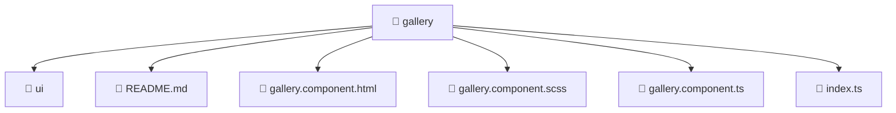

# 📁 gallery

[Root](/.) > [frontend](/frontend) > [src](/frontend/src) > [pages](/frontend/src/pages) > [gallery](/frontend/src/pages/gallery)

## 🎯 Purpose
Delivering luxury-tier architectural components and high-performance logic for the **gallery** domain. This directory is a crucial part of the Mavluda Beauty full-stack ecosystem, ensuring seamless scalability, robust performance, and an elite digital experience.

💎 **FSD Layer:** This directory represents the **Pages** layer in the Feature Sliced Design (FSD) architecture, strictly adhering to its modular principles.

## 🏗️ Architecture


## 📄 File Registry
| File Name | Type | Responsibility | Key Aliases Used |
|---|---|---|---|
| `README.md` | Markdown | Provides core logic and configuration for README.md. | N/A |
| `gallery.component.html` | Template | Structural template and layout for gallery.component.html. | N/A |
| `gallery.component.scss` | Stylesheet | Luxury styling and visual presentation for gallery.component.scss. | N/A |
| `gallery.component.ts` | TypeScript | UI component logic and state management for gallery.component.ts. | @angular, @entities, @environments, @shared |
| `index.ts` | TypeScript | Provides core logic and orchestration for index.ts. | N/A |

## 🔗 Dependencies
- `./gallery`
- `./gallery.component`
- `./ui/gallery-form/gallery-form.component`
- `@angular/common`
- `@angular/core`
- `@angular/forms`
- `@entities/admin-settings`
- `@entities/gallery`
- `@environments/environment`
- `@shared/lib`
- `@shared/lib/object`
- `@shared/models`
- `@shared/ui`

## 🛠️ Usage
```typescript
// Example usage within the Mavluda Beauty ecosystem
import { relevantMember } from './gallery';

// Integrate into the application architecture
relevantMember.execute();
```
