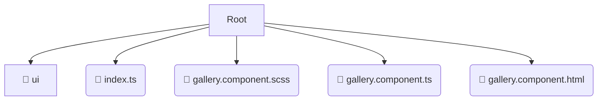

# 📂 gallery

*Breadcrumbs:* [frontend](/frontend) / [src](/frontend/src) / [pages](/frontend/src/pages) / [gallery](/frontend/src/pages/gallery)

## 🎯 PURPOSE
This directory `gallery` is an integral part of the Mavluda Beauty ecosystem. (FSD Layer: Pages) It composes features and widgets into routable page views.
This directory is meticulously maintained to uphold the 'Luxury Professional' standards of the Mavluda Beauty brand.

## 🏗️ ARCHITECTURE


## 📄 FILE REGISTRY
| File Name | Type | Responsibility | Key Aliases Used |
|---|---|---|---|
| `index.ts` | `ts` | Core functionality | `None` |
| `gallery.component.scss` | `scss` | Styling | `None` |
| `gallery.component.ts` | `ts` | UI Component logic | `@environments/environment, @shared/ui, @angular/core...` |
| `gallery.component.html` | `html` | UI Template | `None` |

## 🔗 DEPENDENCIES
- `@environments/environment`
- `@shared/ui`
- `@angular/core`
- `@shared/lib`
- `@angular/common`
- `@shared/lib/object`
- `@entities/gallery`
- `@angular/forms`
- `@shared/models`

## 🛠️ USAGE
```typescript
// Example placeholder for interacting with the gallery module
import { example } from './index.ts';
```
