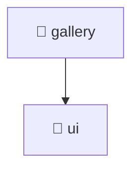

# 📁 gallery

[Root](/.) > [frontend](/frontend) > [src](/frontend/src) > [pages](/frontend/src/pages) > [gallery](/frontend/src/pages/gallery)

## 🎯 Purpose
Delivering luxury-tier architectural components and high-performance logic for the **gallery** domain. This directory is a crucial part of the Mavluda Beauty full-stack ecosystem, ensuring seamless scalability, robust performance, and an elite digital experience.
> **FSD Layer:** Pages - Adhering to strict Feature Sliced Design architectural constraints.

## 🏗️ Architecture


## 📄 File Registry
| File Name | Type | Responsibility | Key Aliases Used |
|---|---|---|---|
| `gallery.component.html` | Template | Visual layout and structural HTML. | N/A |
| `gallery.component.scss` | Stylesheet | Luxury styling and layout logic. | N/A |
| `gallery.component.ts` | Component | UI rendering and component-level state. | @angular, @entities, @shared, @environments |
| `index.ts` | File | Core logic and utilities for this domain. | N/A |


## 🔗 Dependencies
- `@angular/core`
- `@angular/common`
- `@angular/forms`
- `@entities/gallery`
- `@shared/models`
- `./ui/gallery-form/gallery-form.component`
- `@shared/ui`
- `@shared/lib/object`
- `@shared/lib`
- `@environments/environment`
- `./gallery.component`

## 🛠️ Usage
```typescript
// Example usage within the Mavluda Beauty ecosystem
import { relevantMember } from './gallery.component';

// Integrate into the application architecture
relevantMember.execute();
```
