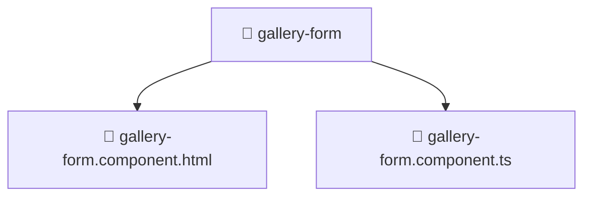

# 📁 Gallery-form

[Root](/.) > [frontend](/frontend) > [src](/frontend/src) > [pages](/frontend/src/pages) > [gallery](/frontend/src/pages/gallery) > [ui](/frontend/src/pages/gallery/ui) > [gallery-form](/frontend/src/pages/gallery/ui/gallery-form)

**FSD Layer:** Pages 📄

## 🎯 Purpose
Delivering luxury-tier architectural components and high-performance logic for the **gallery-form** domain. This directory is a crucial part of the Mavluda Beauty full-stack ecosystem, ensuring seamless scalability, robust performance, and an elite digital experience.

## 🏗️ Architecture


## 📄 File Registry
| File Name | Type | Responsibility | Key Aliases Used |
|---|---|---|---|
| `gallery-form.component.html` | Template | Structural template and layout for gallery-form.component.html. | N/A |
| `gallery-form.component.ts` | TypeScript/JavaScript | UI component logic and state management for gallery-form.component.ts. | @angular, @environments, @features, @shared |

## 🔗 Dependencies
- `@angular/common`
- `@angular/forms/signals`
- `@environments/environment`
- `@features/gallery`
- `@shared/lib`
- `@shared/models`
- `@shared/ui`

## 🛠️ Usage
```typescript
// Example usage within the Mavluda Beauty ecosystem
import { relevantMember } from './gallery-form';

// Integrate into the application architecture
relevantMember.execute();
```
