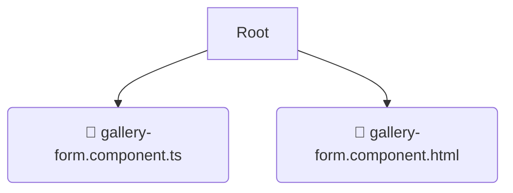

# 📂 gallery-form

*Breadcrumbs:* [frontend](/frontend) / [src](/frontend/src) / [pages](/frontend/src/pages) / [gallery](/frontend/src/pages/gallery) / [ui](/frontend/src/pages/gallery/ui) / [gallery-form](/frontend/src/pages/gallery/ui/gallery-form)

## 🎯 PURPOSE
This directory `gallery-form` is an integral part of the Mavluda Beauty ecosystem. (FSD Layer: Pages) It composes features and widgets into routable page views.
This directory is meticulously maintained to uphold the 'Luxury Professional' standards of the Mavluda Beauty brand.

## 🏗️ ARCHITECTURE


## 📄 FILE REGISTRY
| File Name | Type | Responsibility | Key Aliases Used |
|---|---|---|---|
| `gallery-form.component.ts` | `ts` | UI Component logic | `@environments/environment, @angular/forms/signals, @features/gallery...` |
| `gallery-form.component.html` | `html` | UI Template | `None` |

## 🔗 DEPENDENCIES
- `@environments/environment`
- `@angular/forms/signals`
- `@features/gallery`
- `@shared/ui`
- `@shared/lib`
- `@angular/common`
- `@angular/core`
- `@shared/models`

## 🛠️ USAGE
```typescript
// Example placeholder for interacting with the gallery-form module
import { example } from './gallery-form.component.ts';
```
