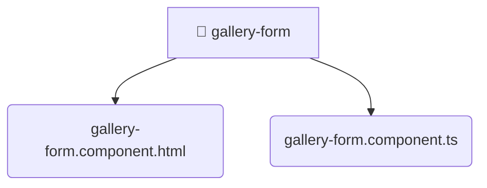

# [frontend](/frontend) / [src](/frontend/src) / [pages](/frontend/src/pages) / [gallery](/frontend/src/pages/gallery) / [ui](/frontend/src/pages/gallery/ui) / [gallery-form](/frontend/src/pages/gallery/ui/gallery-form)

## 🏷️ 📁 Gallery-form

### 🎯 PURPOSE
The `gallery-form` directory forms a critical foundation within the Mavluda Beauty ecosystem, meticulously orchestrating the gallery-form logic to ensure a seamless and premium experience. Integrated within our cutting-edge Angular frontend architecture, it crafts an elegant, highly-responsive user interface reflecting our luxury brand standards. This module is a distinguished component of the **Pages** layer under the Feature Sliced Design (FSD) methodology.

### 🏗️ ARCHITECTURE


### 📄 FILE REGISTRY
| File Name | Type | Responsibility | Key Aliases Used |
|---|---|---|---|
| `gallery-form.component.html` | `html` | Encapsulates premium logic and definitions for `gallery-form.component.html`. | None |
| `gallery-form.component.ts` | `ts` | Encapsulates premium logic and definitions for `gallery-form.component.ts`. | @environments/environment, @shared/ui, @angular/common, @shared/models, @angular/core, @shared/lib, @angular/forms/signals, @features/gallery |


### 🔗 DEPENDENCIES
- `@angular/common`
- `@angular/core`
- `@angular/forms/signals`
- `@environments/environment`
- `@features/gallery`
- `@shared/lib`
- `@shared/models`
- `@shared/ui`

### 🛠️ USAGE
```typescript
// Seamlessly integrate gallery-form into your refined workflows:
import { /* exported members */ } from '@path/to/gallery-form';
```
