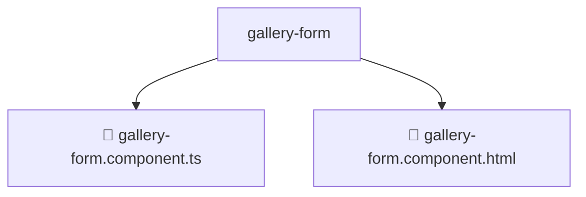

# 📂 GALLERY-FORM

> 💎 **Mavluda Beauty - Luxury Professional Architecture**

### 📍 Breadcrumb Navigation
`. > frontend > src > pages > gallery > ui > gallery-form`

## 🎯 PURPOSE
This directory encapsulates `Pages` level functionality within the Mavluda Beauty ecosystem, ensuring proper separation of concerns and architectural transparency.

**FSD / Architecture Layer:** `Pages`

## 🏗️ ARCHITECTURE


## 📄 FILE REGISTRY

| Item Name | Type | Responsibility | Key Aliases Used |
|-----------|------|----------------|------------------|
| `📄 gallery-form.component.ts` | `.ts` | Component logic | `@angular/forms/signals, @environments/environment, @angular/core, @shared/models, @features/gallery, @angular/common, @shared/lib, @shared/ui` |
| `📄 gallery-form.component.html` | `.html` | Component logic | `None` |

## 🔗 DEPENDENCIES
- `@angular/forms/signals`
- `@environments/environment`
- `@angular/core`
- `@shared/models`
- `@features/gallery`
- `@angular/common`
- `@shared/lib`
- `@shared/ui`

## 🛠️ USAGE
```typescript
// Example usage context
import { ... } from './gallery-form.component';

// Integrate gallery-form.component logic into your feature.
```
