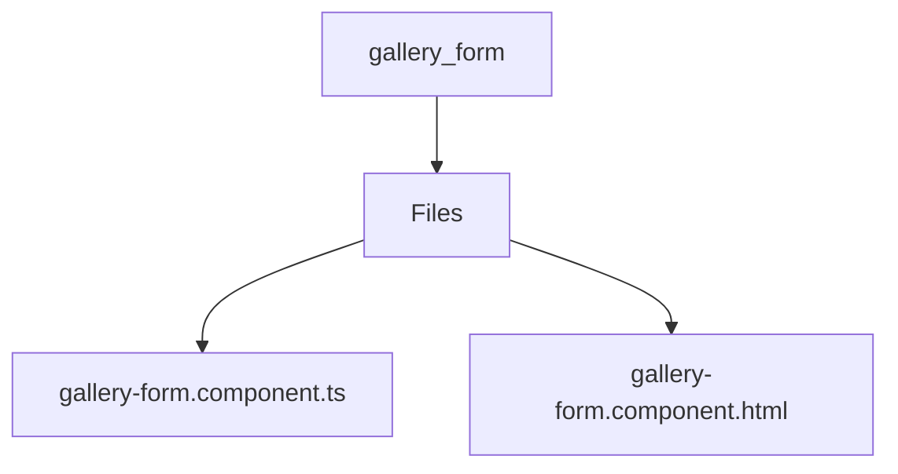

# 🏷️ Gallery Form Directory

> *Elegance, Precision, and Luxury Professionalism — The Mavluda Beauty Standard.*

## 🧭 Breadcrumb Navigation
[frontend](/frontend) ➔ [src](/frontend/src) ➔ [pages](/frontend/src/pages) ➔ [gallery](/frontend/src/pages/gallery) ➔ [ui](/frontend/src/pages/gallery/ui) ➔ [gallery-form](/frontend/src/pages/gallery/ui/gallery-form)

## 🎯 Purpose
This directory encapsulates the essential architecture and logic for the **Gallery Form** domain within the Mavluda Beauty ecosystem. It serves as a foundational component ensuring robust, scalable, and elegant operations.

**Feature Sliced Design (FSD) Layer:** `Pages`

## 🏗️ Architecture


## 📄 File Registry
| File Name | Type | Responsibility | Key Aliases Used |
|---|---|---|---|
| `gallery-form.component.ts` | TypeScript | Exports: GalleryFormComponent | @features, @env, @shared |
| `gallery-form.component.html` | HTML Template | Defines logic and structure for gallery-form.component.html. | None |

## 🔗 Dependencies
- `@angular/common`
- `@angular/core`
- `@angular/forms/signals`
- `@environments/environment`
- `@features/gallery`
- `@shared/lib`
- `@shared/models`
- `@shared/ui`

## 🛠️ Usage
```typescript
// To utilize the luxurious capabilities of this module:
import { GalleryFormComponent } from './path/to/galleryformcomponent';

// Ensure properly typed interactions per Mavluda Beauty standards
```
