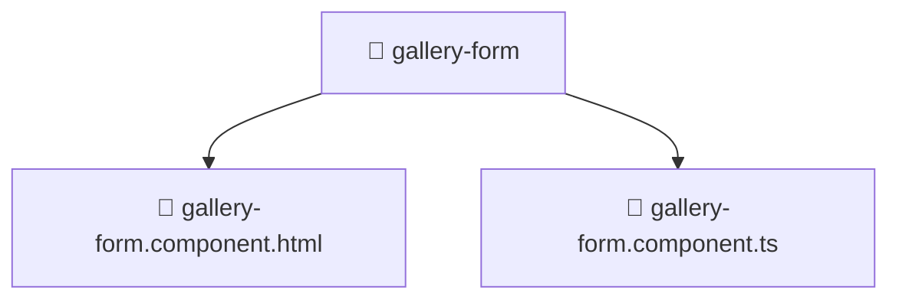

<!--
Mavluda Beauty - Luxury Professional Documentation
Generated for 100% Architectural Transparency
-->
[Home](../../../../../../README.md) > [frontend](../../../../../README.md) > [src](../../../../README.md) > [pages](../../../README.md) > [gallery](../../README.md) > [ui](../README.md) > [gallery-form](./README.md)

# 🖼️ GALLERY-FORM Directory

> **FSD Layer:** Pages

## 🎯 PURPOSE
Represents full application views and routes orchestrating widgets and features.

## 🏗️ ARCHITECTURE


## 📄 FILE REGISTRY
| File Name | Type | Responsibility | Key Aliases Used |
|---|---|---|---|
| `gallery-form.component.html` | HTML Template | UI rendering and component logic. | - |
| `gallery-form.component.ts` | TypeScript | UI rendering and component logic. | @angular, @shared, @features, @environments |


## 🔗 DEPENDENCIES
- `@angular/common`
- `@angular/forms/signals`
- `@shared/models`
- `@shared/lib`
- `@features/gallery`
- `@shared/ui`
- `@environments/environment`

## 🛠️ USAGE
```typescript
// Example placeholder for interacting with gallery-form
// Consult the individual files in the registry for specific APIs.
```
