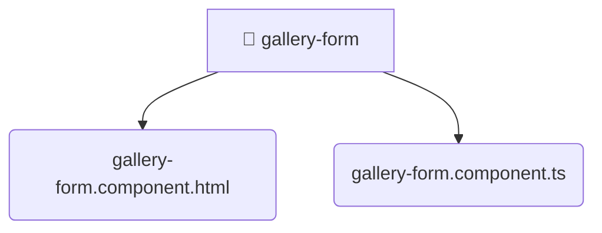

# [root](/) / [frontend](/frontend) / [src](/frontend/src) / [pages](/frontend/src/pages) / [gallery](/frontend/src/pages/gallery) / [ui](/frontend/src/pages/gallery/ui) / [gallery-form](/frontend/src/pages/gallery/ui/gallery-form)

## 🏷️ 📁 Gallery-form (Page Layer)

### 🎯 PURPOSE
The `gallery-form` page component orchestrates the UI layer for the gallery-form feature in the Mavluda Beauty frontend application.

### 🏗️ ARCHITECTURE


### 📄 FILE REGISTRY
| File Name | Type | Responsibility | Key Aliases Used |
|---|---|---|---|
| `gallery-form.component.html` | `html` | UI template and styling. | None |
| `gallery-form.component.ts` | `ts` | UI component logic and rendering. | @angular, @shared, @features, @environments |

### 🔗 DEPENDENCIES
- `@angular/common`
- `@angular/core`
- `@angular/forms/signals`
- `@environments/environment`
- `@features/gallery`
- `@shared/lib`
- `@shared/models`
- `@shared/ui`

### 🛠️ USAGE
```typescript
// Seamlessly integrate gallery-form into your refined workflows:
import { /* exported members */ } from '@path/to/gallery-form';
```
