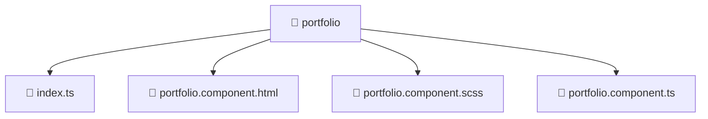

# 📁 Portfolio

[Root](../../../../) > [frontend](../../../) > [src](../../) > [pages](../) > [portfolio](./)

## 🎯 Purpose
Delivering luxury-tier architectural components and high-performance logic for the **Portfolio** domain. This directory is a crucial part of the Mavluda Beauty full-stack ecosystem, ensuring seamless scalability, robust performance, and an elite digital experience.

**Architecture Layer:** Pages (Feature Sliced Design / Layered Architecture)

## 🏗️ Architecture


## 📄 File Registry
| File Name | Type | Responsibility | Key Aliases Used |
|---|---|---|---|
| `index.ts` | TypeScript | Core logic and utilities for this domain. | N/A |
| `portfolio.component.html` | HTML Template | Core logic and utilities for this domain. | N/A |
| `portfolio.component.scss` | SCSS Stylesheet | Core logic and utilities for this domain. | N/A |
| `portfolio.component.ts` | TypeScript | Core logic and utilities for this domain. | @environments/environment, @angular/core, @entities/admin-settings, @shared/lib, @angular/common, @entities/gallery |


## 🔗 Dependencies
- `@angular/common`
- `@angular/core`
- `@entities/admin-settings`
- `@entities/gallery`
- `@environments/environment`
- `@shared/lib`

## 🛠️ Usage
```markdown
> This directory acts primarily as a structural container or logic module.
> To interact with its contents, import the relevant exported members from the `index.ts` or specifically targeted files.
```
