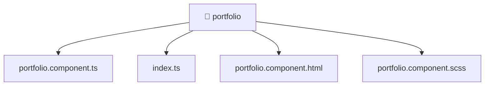

[🏠 Home](../../../../README.md) > [frontend](../../../README.md) > [src](../../README.md) > [pages](../README.md) > [portfolio](./README.md)

# 📁 portfolio

**FSD Layer:** `Pages`

### 🎯 PURPOSE
Welcome to the exquisite **portfolio** module of the Mavluda Beauty ecosystem. This directory focuses on orchestrating UI Components. It is designed adhering to our 'Luxury Professional' standards.

### 🏗️ ARCHITECTURE


### 📄 FILE REGISTRY
| File Name | Type | Responsibility | Key Aliases Used |
|---|---|---|---|
| `index.ts` | TypeScript File | Exports or orchestrates module members. | None |
| `portfolio.component.html` | HTML Template | Provides logic and definitions for portfolio.component.html. | None |
| `portfolio.component.scss` | Stylesheet | Provides logic and definitions for portfolio.component.scss. | None |
| `portfolio.component.ts` | Angular Component | Defines a UI component and its logic Defines classes: PortfolioPageComponent. | @environments, @entities, @angular, @shared |

### 🔗 DEPENDENCIES
- `@angular/common`
- `@entities/admin-settings`
- `@entities/gallery`
- `@environments/environment`
- `@shared/lib`

### 🛠️ USAGE
```typescript
// Example interaction or integration snippet
// Import members from portfolio based on module boundaries
```
