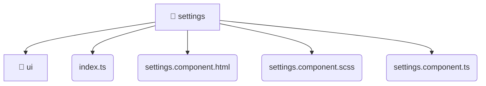

# [root](/) / [frontend](/frontend) / [src](/frontend/src) / [pages](/frontend/src/pages) / [settings](/frontend/src/pages/settings)

## 🏷️ 📁 Settings (Page Layer)

### 🎯 PURPOSE
The `settings` page component orchestrates the UI layer for the settings feature in the Mavluda Beauty frontend application.

### 🏗️ ARCHITECTURE


### 📄 FILE REGISTRY
| File Name | Type | Responsibility | Key Aliases Used |
|---|---|---|---|
| `index.ts` | `ts` | Core logic implementation. | None |
| `settings.component.html` | `html` | UI template and styling. | None |
| `settings.component.scss` | `scss` | UI template and styling. | None |
| `settings.component.ts` | `ts` | UI component logic and rendering. | @angular, @entities, @shared |

### 🔗 DEPENDENCIES
- `./settings.component`
- `./ui/additional-links.component`
- `./ui/business-profile.component`
- `./ui/general-info.component`
- `./ui/selects-settings.component`
- `@angular/common`
- `@angular/core`
- `@angular/forms`
- `@entities/admin-settings`
- `@shared/models/admin-settings.model`
- `...`

### 🛠️ USAGE
```typescript
// Seamlessly integrate settings into your refined workflows:
import { /* exported members */ } from '@path/to/settings';
```
