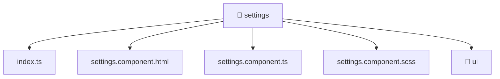

[🏠 Home](../../../../README.md) > [frontend](../../../README.md) > [src](../../README.md) > [pages](../README.md) > [settings](./README.md)

# 📁 settings

**FSD Layer:** `Pages`

### 🎯 PURPOSE
Welcome to the exquisite **settings** module of the Mavluda Beauty ecosystem. This directory focuses on orchestrating UI Components. It is designed adhering to our 'Luxury Professional' standards.

### 🏗️ ARCHITECTURE


### 📄 FILE REGISTRY
| File Name | Type | Responsibility | Key Aliases Used |
|---|---|---|---|
| `index.ts` | TypeScript File | Exports or orchestrates module members. | None |
| `settings.component.html` | HTML Template | Provides logic and definitions for settings.component.html. | None |
| `settings.component.scss` | Stylesheet | Provides logic and definitions for settings.component.scss. | None |
| `settings.component.ts` | Angular Component | Defines a UI component and its logic Defines classes: SettingsComponent. | @entities, @angular, @shared |

### 🔗 DEPENDENCIES
- `@angular/common`
- `@angular/core`
- `@angular/core/rxjs-interop`
- `@angular/forms`
- `@entities/admin-settings`
- `@shared/models/admin-settings.model`
- `rxjs`

### 🛠️ USAGE
```typescript
// Example interaction or integration snippet
// Import members from settings based on module boundaries
```
