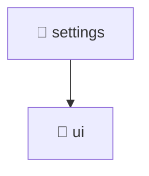

# 📁 settings

[Root](/.) > [frontend](/frontend) > [src](/frontend/src) > [pages](/frontend/src/pages) > [settings](/frontend/src/pages/settings)

## 🎯 Purpose
Delivering luxury-tier architectural components and high-performance logic for the **settings** domain. This directory is a crucial part of the Mavluda Beauty full-stack ecosystem, ensuring seamless scalability, robust performance, and an elite digital experience.
> **FSD Layer:** Pages - Adhering to strict Feature Sliced Design architectural constraints.

## 🏗️ Architecture


## 📄 File Registry
| File Name | Type | Responsibility | Key Aliases Used |
|---|---|---|---|
| `index.ts` | File | Core logic and utilities for this domain. | N/A |
| `settings.component.html` | Template | Visual layout and structural HTML. | N/A |
| `settings.component.scss` | Stylesheet | Luxury styling and layout logic. | N/A |
| `settings.component.ts` | Component | UI rendering and component-level state. | @angular, @entities, @shared |


## 🔗 Dependencies
- `./settings.component`
- `@angular/core`
- `@angular/common`
- `@angular/forms`
- `@entities/admin-settings`
- `@shared/models/admin-settings.model`
- `./ui/business-profile.component`
- `./ui/social-matrix.component`
- `./ui/general-info.component`
- `./ui/additional-links.component`
- `./ui/selects-settings.component`

## 🛠️ Usage
```typescript
// Example usage within the Mavluda Beauty ecosystem
import { relevantMember } from './index';

// Integrate into the application architecture
relevantMember.execute();
```
