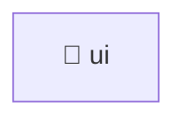

# 💅 ui

[Root](/.) / [frontend](../../../..) / [src](../../..) / [pages](../..) / [settings](..) / [ui](.)

## 🎯 Purpose
Delivering luxury-tier architectural components and high-performance logic for the **ui** domain. This directory orchestrates precise operations within the Mavluda Beauty ecosystem, maintaining our elite standards of digital excellence.

*This directory operates strictly within the **Pages** layer of our Feature Sliced Design (FSD) architecture.*

## 🏗️ Architecture


## 📄 File Registry
| File Name | Type | Responsibility | Key Aliases Used |
|---|---|---|---|
| `additional-links.component.ts` | TypeScript | UI rendering and user interaction. | @angular |
| `business-profile.component.ts` | TypeScript | UI rendering and user interaction. | @angular, @shared |
| `general-info.component.ts` | TypeScript | UI rendering and user interaction. | @angular |
| `selects-settings.component.ts` | TypeScript | UI rendering and user interaction. | @angular |
| `social-matrix.component.ts` | TypeScript | UI rendering and user interaction. | @angular |

## 🔗 Dependencies
- `@angular`
- `@shared`

## 🛠️ Usage
```markdown
> This directory acts primarily as a structural container or logic module.
> To interact with its contents, import the relevant exported members from the `index.ts` or specifically targeted files.
```
