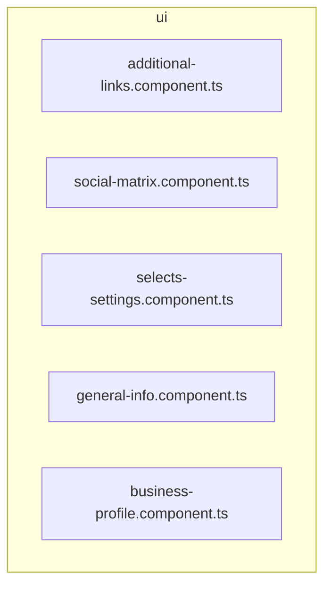

# 🎨 ui

[frontend](../../../../README.md) > [src](../../../README.md) > [pages](../../README.md) > [settings](../README.md) > [ui](README.md)

---

### 🎯 PURPOSE
Elevating the digital experience for the Mavluda Beauty ecosystem, this module manages the sophisticated Pages Layer (Routing and page-level components) operations.

*FSD Layer:* **Pages Layer (Routing and page-level components)**

---

### 🏗️ ARCHITECTURE



---

### 📄 FILE REGISTRY
| File Name | Type | Responsibility | Key Aliases Used |
|-----------|------|----------------|------------------|
| `additional-links.component.ts` | Component | Handles component logic for Mavluda Beauty's luxury standards. | `@angular` |
| `social-matrix.component.ts` | Component | Handles component logic for Mavluda Beauty's luxury standards. | `@angular` |
| `selects-settings.component.ts` | Component | Handles component logic for Mavluda Beauty's luxury standards. | `@angular` |
| `general-info.component.ts` | Component | Handles component logic for Mavluda Beauty's luxury standards. | `@angular` |
| `business-profile.component.ts` | Component | Handles component logic for Mavluda Beauty's luxury standards. | `@shared, @angular` |

---

### 🔗 DEPENDENCIES
**Key Path Aliases Detected:** `@shared`, `@angular`

Notable imports:
- `@angular/forms`
- `@angular/common`
- `@shared/models`
- `@angular/core`
- `leaflet`

---

### 🛠️ USAGE
To interact with this directory's luxurious logic, integrate its exported components or services directly into your feature modules. Ensure strict adherence to the Pages Layer (Routing and page-level components) boundaries.

```typescript
// Example integration snippet
import { FeatureModule } from '@path/to/ui';
```
