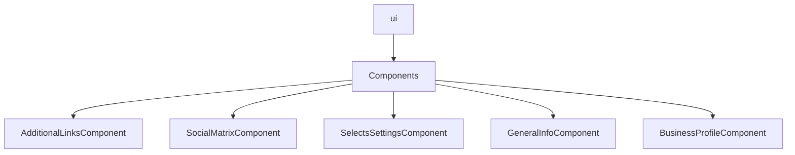
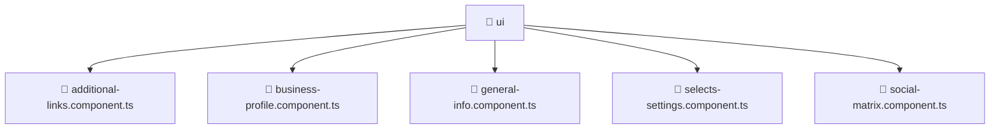

# 🖼️ Ui Directory

[frontend](/frontend) > [src](/frontend/src) > [pages](/frontend/src/pages) > [settings](/frontend/src/pages/settings) > [ui](/frontend/src/pages/settings/ui)

## 🎯 Purpose
A high-level module handling `ui` logic within the Mavluda Beauty ecosystem. This directory adheres to our "Luxury Professional" architectural standards.

**FSD Layer:** Pages


## 🏗️ Architecture



## 📄 File Registry
| File Name | Type | Responsibility | Key Aliases Used |
|-----------|------|----------------|------------------|
| `additional-links.component.ts` | Component | Angular UI standalone component logic. | @angular/forms, @angular/core, @angular/common |
| `business-profile.component.ts` | Component | Angular UI standalone component logic. | @angular/forms, @angular/core, @angular/common, @shared/models |
| `general-info.component.ts` | Component | Angular UI standalone component logic. | @angular/forms, @angular/core, @angular/common |
| `selects-settings.component.ts` | Component | Angular UI standalone component logic. | @angular/forms, @angular/core, @angular/common |
| `social-matrix.component.ts` | Component | Angular UI standalone component logic. | @angular/forms, @angular/core, @angular/common |

## 🔗 Dependencies
- `@angular/common`
- `@angular/core`
- `@angular/forms`
- `@shared/models`

## 🛠️ Usage
```typescript
// Architectural overview snippet
import { InternalLogic } from './internal-file';
// Ensure adherence to Hexagonal / FSD principles
```

## 📝 Existing Context
# 📁 ui

[Root](/.) > [frontend](/frontend) > [src](/frontend/src) > [pages](/frontend/src/pages) > [settings](/frontend/src/pages/settings) > [ui](/frontend/src/pages/settings/ui)

**FSD Layer:** Page

## 🎯 Purpose
Delivering luxury-tier architectural components and high-performance logic for the **ui** domain. This directory is a crucial part of the Mavluda Beauty full-stack ecosystem, ensuring seamless scalability, robust performance, and an elite digital experience.

## 🏗️ Architecture


## 📄 File Registry
| File Name | Type | Responsibility | Key Aliases Used |
|---|---|---|---|
| `additional-links.component.ts` | TypeScript | UI component logic and state management for additional-links.component.ts. | @angular |
| `business-profile.component.ts` | TypeScript | UI component logic and state management for business-profile.component.ts. | @angular, @shared |
| `general-info.component.ts` | TypeScript | UI component logic and state management for general-info.component.ts. | @angular |
| `selects-settings.component.ts` | TypeScript | UI component logic and state management for selects-settings.component.ts. | @angular |
| `social-matrix.component.ts` | TypeScript | UI component logic and state management for social-matrix.component.ts. | @angular |

## 🔗 Dependencies
- `@angular/common`
- `@angular/core`
- `@angular/forms`
- `@shared/models`
- `leaflet`

## 🛠️ Usage
```typescript
// Example usage within the Mavluda Beauty ecosystem
import { relevantMember } from './ui';

// Integrate into the application architecture
relevantMember.execute();
```
