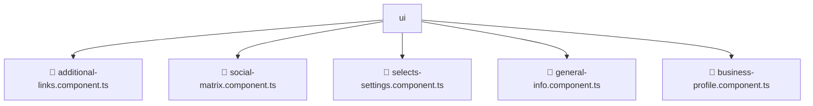

# 📂 UI

> 💎 **Mavluda Beauty - Luxury Professional Architecture**

### 📍 Breadcrumb Navigation
`. > frontend > src > pages > settings > ui`

## 🎯 PURPOSE
This directory encapsulates `Pages` level functionality within the Mavluda Beauty ecosystem, ensuring proper separation of concerns and architectural transparency.

**FSD / Architecture Layer:** `Pages`

## 🏗️ ARCHITECTURE


## 📄 FILE REGISTRY

| Item Name | Type | Responsibility | Key Aliases Used |
|-----------|------|----------------|------------------|
| `📄 additional-links.component.ts` | `.ts` | Component logic | `@angular/core, @angular/forms, @angular/common` |
| `📄 social-matrix.component.ts` | `.ts` | Component logic | `@angular/core, @angular/forms, @angular/common` |
| `📄 selects-settings.component.ts` | `.ts` | Component logic | `@angular/core, @angular/forms, @angular/common` |
| `📄 general-info.component.ts` | `.ts` | Component logic | `@angular/core, @angular/forms, @angular/common` |
| `📄 business-profile.component.ts` | `.ts` | Component logic | `@angular/core, @shared/models, @angular/common, @angular/forms` |

## 🔗 DEPENDENCIES
- `@angular/core`
- `@angular/forms`
- `@shared/models`
- `@angular/common`

## 🛠️ USAGE
```typescript
// Example usage context
import { ... } from './additional-links.component';

// Integrate additional-links.component logic into your feature.
```
