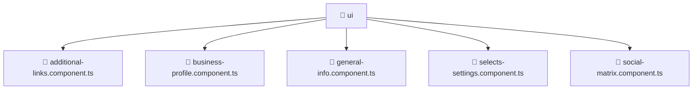

### 🧭 Breadcrumbs
[Root](/) > [frontend](/frontend) > [src](/frontend/src) > [pages](/frontend/src/pages) > [settings](/frontend/src/pages/settings) > [ui](/frontend/src/pages/settings/ui)

# 📁 Ui Directory
**Architecture Layer:** Page Layer

## 🎯 Purpose
Provides luxury professional architectural implementation for the ui module within the Mavluda Beauty ecosystem. Ensure robust functionality and elegant integration with the broader architecture.

## 🏗️ ARCHITECTURE


## 📄 FILE REGISTRY
| File Name | Type | Responsibility | Key Aliases Used |
|---|---|---|---|
| `additional-links.component.ts` | TypeScript | UI component logic and state management for additional-links.component.ts. | @angular/core, @angular/forms, @angular/common |
| `business-profile.component.ts` | TypeScript | UI component logic and state management for business-profile.component.ts. | @angular/core, @shared/models, @angular/forms, @angular/common |
| `general-info.component.ts` | TypeScript | UI component logic and state management for general-info.component.ts. | @angular/core, @angular/forms, @angular/common |
| `selects-settings.component.ts` | TypeScript | UI component logic and state management for selects-settings.component.ts. | @angular/core, @angular/forms, @angular/common |
| `social-matrix.component.ts` | TypeScript | UI component logic and state management for social-matrix.component.ts. | @angular/core, @angular/forms, @angular/common |

## 🔗 DEPENDENCIES
- `@angular/common`
- `@angular/core`
- `@angular/forms`
- `@shared/models`

## 🛠️ USAGE
```typescript
// Example architectural integration for ui
// Utilize the exported members according to Mavluda Beauty's standard conventions.
```

---
*Maintained by Mavluda Beauty - Architecture & Engineering*

---
*Maintained by Mavluda Beauty - Architecture & Engineering*