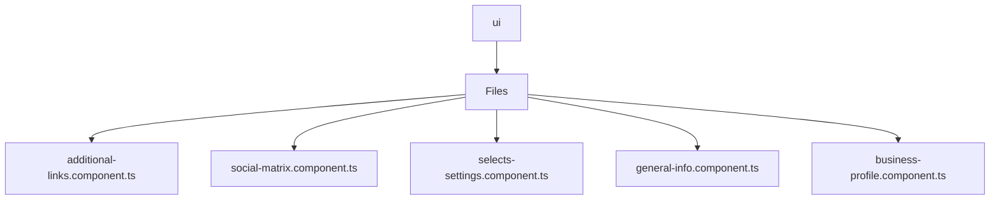

# 🏷️ Ui Directory

> *Elegance, Precision, and Luxury Professionalism — The Mavluda Beauty Standard.*

## 🧭 Breadcrumb Navigation
[frontend](/frontend) ➔ [src](/frontend/src) ➔ [pages](/frontend/src/pages) ➔ [settings](/frontend/src/pages/settings) ➔ [ui](/frontend/src/pages/settings/ui)

## 🎯 Purpose
This directory encapsulates the essential architecture and logic for the **Ui** domain within the Mavluda Beauty ecosystem. It serves as a foundational component ensuring robust, scalable, and elegant operations.

**Feature Sliced Design (FSD) Layer:** `Pages`

## 🏗️ Architecture


## 📄 File Registry
| File Name | Type | Responsibility | Key Aliases Used |
|---|---|---|---|
| `additional-links.component.ts` | TypeScript | Exports: AdditionalLink, AdditionalLinksComponent | None |
| `social-matrix.component.ts` | TypeScript | Exports: SocialPlatform, SocialMatrixComponent | None |
| `selects-settings.component.ts` | TypeScript | Exports: SelectListType, SelectsSettingsComponent | None |
| `general-info.component.ts` | TypeScript | Exports: GeneralInfoComponent | None |
| `business-profile.component.ts` | TypeScript | Exports: BusinessProfileComponent | @shared |

## 🔗 Dependencies
- `@angular/common`
- `@angular/core`
- `@angular/forms`
- `@shared/models`
- `leaflet`

## 🛠️ Usage
```typescript
// To utilize the luxurious capabilities of this module:
import { AdditionalLink } from './path/to/additionallink';

// Ensure properly typed interactions per Mavluda Beauty standards
```
