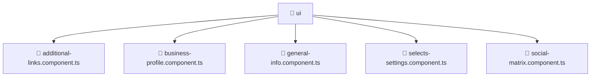

<!--
Mavluda Beauty - Luxury Professional Documentation
Generated for 100% Architectural Transparency
-->
[Home](../../../../../README.md) > [frontend](../../../../README.md) > [src](../../../README.md) > [pages](../../README.md) > [settings](../README.md) > [ui](./README.md)

# 📁 UI Directory

> **FSD Layer:** Pages

## 🎯 PURPOSE
Represents full application views and routes orchestrating widgets and features.

## 🏗️ ARCHITECTURE


## 📄 FILE REGISTRY
| File Name | Type | Responsibility | Key Aliases Used |
|---|---|---|---|
| `additional-links.component.ts` | TypeScript | UI rendering and component logic. | @angular |
| `business-profile.component.ts` | TypeScript | UI rendering and component logic. | @angular, @shared |
| `general-info.component.ts` | TypeScript | UI rendering and component logic. | @angular |
| `selects-settings.component.ts` | TypeScript | UI rendering and component logic. | @angular |
| `social-matrix.component.ts` | TypeScript | UI rendering and component logic. | @angular |


## 🔗 DEPENDENCIES
- `@angular/core`
- `@angular/common`
- `@angular/forms`
- `@shared/models`
- `leaflet`

## 🛠️ USAGE
```typescript
// Example placeholder for interacting with ui
// Consult the individual files in the registry for specific APIs.
```
