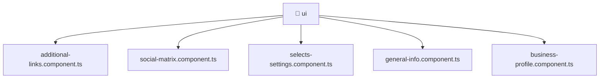

[🏠 Home](../../../../../README.md) > [frontend](../../../../README.md) > [src](../../../README.md) > [pages](../../README.md) > [settings](../README.md) > [ui](./README.md)

# 📁 ui

**FSD Layer:** `Pages`

### 🎯 PURPOSE
Welcome to the exquisite **ui** module of the Mavluda Beauty ecosystem. This directory focuses on orchestrating UI Components. It is designed adhering to our 'Luxury Professional' standards.

### 🏗️ ARCHITECTURE


### 📄 FILE REGISTRY
| File Name | Type | Responsibility | Key Aliases Used |
|---|---|---|---|
| `additional-links.component.ts` | Angular Component | Defines a UI component and its logic Defines classes: AdditionalLinksComponent. | @angular |
| `business-profile.component.ts` | Angular Component | Defines a UI component and its logic Defines classes: BusinessProfileComponent. | @angular, @shared |
| `general-info.component.ts` | Angular Component | Defines a UI component and its logic Defines classes: GeneralInfoComponent. | @angular |
| `selects-settings.component.ts` | Angular Component | Defines a UI component and its logic Defines classes: SelectsSettingsComponent. | @angular |
| `social-matrix.component.ts` | Angular Component | Defines a UI component and its logic Defines classes: SocialMatrixComponent. | @angular |

### 🔗 DEPENDENCIES
- `@angular/common`
- `@angular/core`
- `@angular/forms`
- `@shared/models`
- `leaflet`

### 🛠️ USAGE
```typescript
// Example interaction or integration snippet
// Import members from ui based on module boundaries
```
