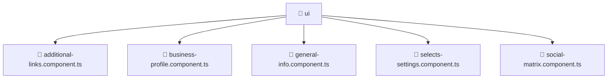

# 📁 ui

[Root](/.) > [frontend](/frontend) > [src](/frontend/src) > [pages](/frontend/src/pages) > [settings](/frontend/src/pages/settings) > [ui](/frontend/src/pages/settings/ui)

**FSD Layer:** Page

## 🎯 Purpose
Delivering luxury-tier architectural components and high-performance logic for the **Ui** domain. This directory is a crucial part of the Mavluda Beauty full-stack ecosystem, ensuring seamless scalability, robust performance, and an elite digital experience.

**Architecture Layer:** Pages (Feature Sliced Design / Layered Architecture)

## 🏗️ Architecture


## 📄 File Registry
| File Name | Type | Responsibility | Key Aliases Used |
|---|---|---|---|
| `additional-links.component.ts` | TypeScript | Core logic and utilities for this domain. | @angular |
| `business-profile.component.ts` | TypeScript | Core logic and utilities for this domain. | @angular, @shared |
| `general-info.component.ts` | TypeScript | Core logic and utilities for this domain. | @angular |
| `selects-settings.component.ts` | TypeScript | Core logic and utilities for this domain. | @angular |
| `social-matrix.component.ts` | TypeScript | Core logic and utilities for this domain. | @angular |

## 🔗 Dependencies
- `@angular/common`
- `@angular/core`
- `@angular/forms`
- `@shared/models`
- `leaflet`

## 🛠️ Usage
```markdown
```markdown
> This directory acts primarily as a structural container or logic module.
> To interact with its contents, import the relevant exported members from the `index.ts` or specifically targeted files.
```
```
