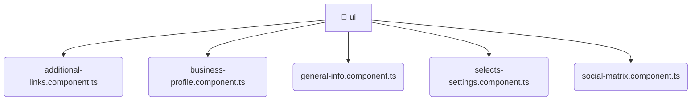

# [root](/) / [frontend](/frontend) / [src](/frontend/src) / [pages](/frontend/src/pages) / [settings](/frontend/src/pages/settings) / [ui](/frontend/src/pages/settings/ui)

## 🏷️ 📁 Ui

### 🎯 PURPOSE
The `ui` directory forms a critical foundation within the Mavluda Beauty ecosystem, meticulously orchestrating the ui logic to ensure a seamless and premium experience.

This directory resides within the **Pages** layer of our Feature Sliced Design (FSD) architecture, strictly adhering to Mavluda Beauty's robust separation of concerns.

### 🏗️ ARCHITECTURE


### 📄 FILE REGISTRY
| File Name | Type | Responsibility | Key Aliases Used |
|---|---|---|---|
| `additional-links.component.ts` | `ts` | UI component logic and rendering. | @angular |
| `business-profile.component.ts` | `ts` | UI component logic and rendering. | @angular, @shared |
| `general-info.component.ts` | `ts` | UI component logic and rendering. | @angular |
| `selects-settings.component.ts` | `ts` | UI component logic and rendering. | @angular |
| `social-matrix.component.ts` | `ts` | UI component logic and rendering. | @angular |

### 🔗 DEPENDENCIES
- `@angular/common`
- `@angular/core`
- `@angular/forms`
- `@shared/models`
- `leaflet`

### 🛠️ USAGE
```typescript
// Seamlessly integrate ui into your refined workflows:
import { /* exported members */ } from '@path/to/ui';
```
