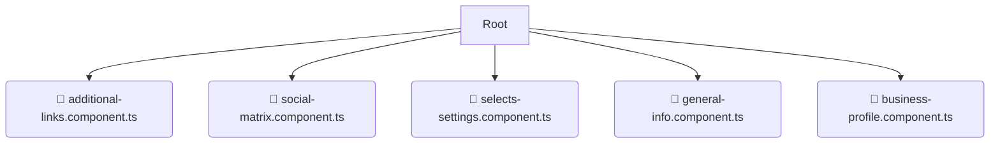

# 📂 ui

*Breadcrumbs:* [frontend](/frontend) / [src](/frontend/src) / [pages](/frontend/src/pages) / [settings](/frontend/src/pages/settings) / [ui](/frontend/src/pages/settings/ui)

## 🎯 PURPOSE
This directory `ui` is an integral part of the Mavluda Beauty ecosystem. (FSD Layer: Pages) It composes features and widgets into routable page views.
This directory is meticulously maintained to uphold the 'Luxury Professional' standards of the Mavluda Beauty brand.

## 🏗️ ARCHITECTURE


## 📄 FILE REGISTRY
| File Name | Type | Responsibility | Key Aliases Used |
|---|---|---|---|
| `additional-links.component.ts` | `ts` | UI Component logic | `@angular/forms, @angular/core, @angular/common` |
| `social-matrix.component.ts` | `ts` | UI Component logic | `@angular/forms, @angular/core, @angular/common` |
| `selects-settings.component.ts` | `ts` | UI Component logic | `@angular/forms, @angular/core, @angular/common` |
| `general-info.component.ts` | `ts` | UI Component logic | `@angular/forms, @angular/core, @angular/common` |
| `business-profile.component.ts` | `ts` | UI Component logic | `@angular/forms, @angular/core, @angular/common...` |

## 🔗 DEPENDENCIES
- `@angular/forms`
- `@angular/core`
- `@angular/common`
- `@shared/models`

## 🛠️ USAGE
```typescript
// Example placeholder for interacting with the ui module
import { example } from './additional-links.component.ts';
```
