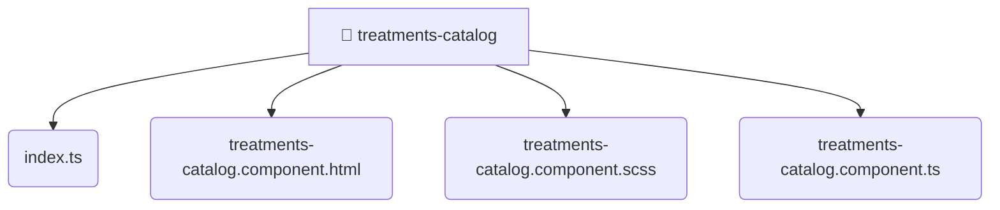

# [frontend](/frontend) / [src](/frontend/src) / [pages](/frontend/src/pages) / [treatments-catalog](/frontend/src/pages/treatments-catalog)

## 🏷️ 📁 Treatments-catalog

### 🎯 PURPOSE
The `treatments-catalog` directory forms a critical foundation within the Mavluda Beauty ecosystem, meticulously orchestrating the treatments-catalog logic to ensure a seamless and premium experience. Integrated within our cutting-edge Angular frontend architecture, it crafts an elegant, highly-responsive user interface reflecting our luxury brand standards. This module is a distinguished component of the **Pages** layer under the Feature Sliced Design (FSD) methodology.

### 🏗️ ARCHITECTURE


### 📄 FILE REGISTRY
| File Name | Type | Responsibility | Key Aliases Used |
|---|---|---|---|
| `index.ts` | `ts` | Encapsulates premium logic and definitions for `index.ts`. | None |
| `treatments-catalog.component.html` | `html` | Encapsulates premium logic and definitions for `treatments-catalog.component.html`. | None |
| `treatments-catalog.component.scss` | `scss` | Encapsulates premium logic and definitions for `treatments-catalog.component.scss`. | None |
| `treatments-catalog.component.ts` | `ts` | Encapsulates premium logic and definitions for `treatments-catalog.component.ts`. | @angular/core, @angular/common |


### 🔗 DEPENDENCIES
- `@angular/common`
- `@angular/core`

### 🛠️ USAGE
```typescript
// Seamlessly integrate treatments-catalog into your refined workflows:
import { /* exported members */ } from '@path/to/treatments-catalog';
```
