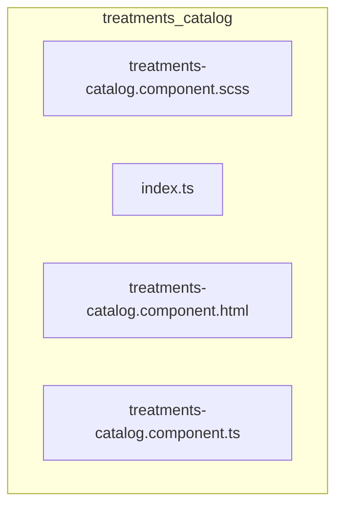

# 📁 treatments-catalog

[frontend](../../../README.md) > [src](../../README.md) > [pages](../README.md) > [treatments-catalog](README.md)

---

### 🎯 PURPOSE
Elevating the digital experience for the Mavluda Beauty ecosystem, this module manages the sophisticated Pages Layer (Routing and page-level components) operations.

*FSD Layer:* **Pages Layer (Routing and page-level components)**

---

### 🏗️ ARCHITECTURE



---

### 📄 FILE REGISTRY
| File Name | Type | Responsibility | Key Aliases Used |
|-----------|------|----------------|------------------|
| `treatments-catalog.component.scss` | Styles | Handles styles logic for Mavluda Beauty's luxury standards. | `None` |
| `index.ts` | Source | Handles source logic for Mavluda Beauty's luxury standards. | `None` |
| `treatments-catalog.component.html` | Template | Handles template logic for Mavluda Beauty's luxury standards. | `None` |
| `treatments-catalog.component.ts` | Component | Handles component logic for Mavluda Beauty's luxury standards. | `@shared, @entities, @angular, @environments` |

---

### 🔗 DEPENDENCIES
**Key Path Aliases Detected:** `@shared`, `@entities`, `@angular`, `@environments`

Notable imports:
- `@entities/treatments`
- `@entities/admin-settings`
- `@angular/common`
- `@environments/environment`
- `./treatments-catalog.component`
- `@shared/lib`
- `@angular/core`

---

### 🛠️ USAGE
To interact with this directory's luxurious logic, integrate its exported components or services directly into your feature modules. Ensure strict adherence to the Pages Layer (Routing and page-level components) boundaries.

```typescript
// Example integration snippet
import { FeatureModule } from '@path/to/treatments-catalog';
```
