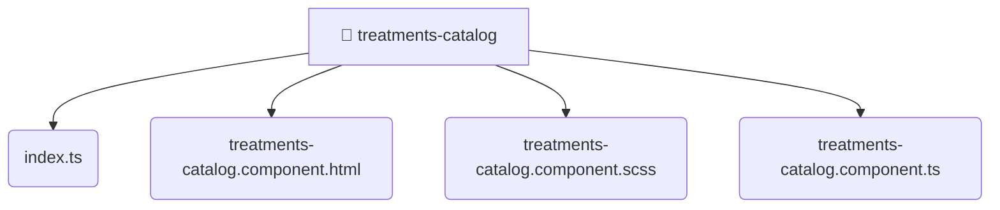

# [root](/) / [frontend](/frontend) / [src](/frontend/src) / [pages](/frontend/src/pages) / [treatments-catalog](/frontend/src/pages/treatments-catalog)

## 🏷️ 📁 Treatments-catalog

### 🎯 PURPOSE
The `treatments-catalog` directory forms a critical foundation within the Mavluda Beauty ecosystem, meticulously orchestrating the treatments-catalog logic to ensure a seamless and premium experience.

This directory resides within the **Pages** layer of our Feature Sliced Design (FSD) architecture, strictly adhering to Mavluda Beauty's robust separation of concerns.

### 🏗️ ARCHITECTURE


### 📄 FILE REGISTRY
| File Name | Type | Responsibility | Key Aliases Used |
|---|---|---|---|
| `index.ts` | `ts` | Core logic implementation. | None |
| `treatments-catalog.component.html` | `html` | UI template and styling. | None |
| `treatments-catalog.component.scss` | `scss` | UI template and styling. | None |
| `treatments-catalog.component.ts` | `ts` | UI component logic and rendering. | @angular |

### 🔗 DEPENDENCIES
- `./treatments-catalog.component`
- `@angular/common`
- `@angular/core`

### 🛠️ USAGE
```typescript
// Seamlessly integrate treatments-catalog into your refined workflows:
import { /* exported members */ } from '@path/to/treatments-catalog';
```
