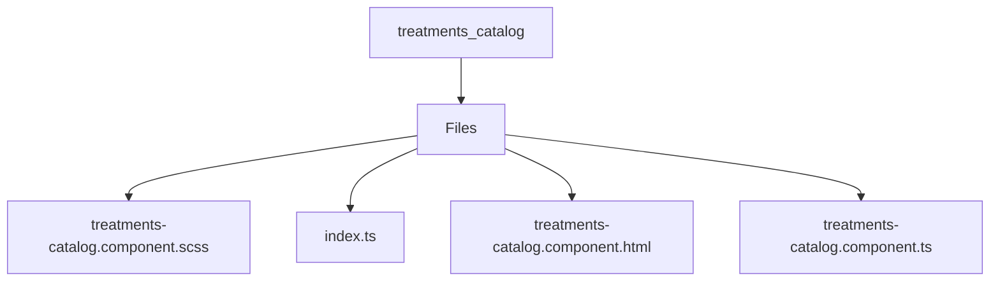

# 🏷️ Treatments Catalog Directory

> *Elegance, Precision, and Luxury Professionalism — The Mavluda Beauty Standard.*

## 🧭 Breadcrumb Navigation
[frontend](/frontend) ➔ [src](/frontend/src) ➔ [pages](/frontend/src/pages) ➔ [treatments-catalog](/frontend/src/pages/treatments-catalog)

## 🎯 Purpose
This directory encapsulates the essential architecture and logic for the **Treatments Catalog** domain within the Mavluda Beauty ecosystem. It serves as a foundational component ensuring robust, scalable, and elegant operations.

**Feature Sliced Design (FSD) Layer:** `Pages`

## 🏗️ Architecture


## 📄 File Registry
| File Name | Type | Responsibility | Key Aliases Used |
|---|---|---|---|
| `treatments-catalog.component.scss` | Stylesheet | Defines logic and structure for treatments-catalog.component.scss. | None |
| `index.ts` | TypeScript | Defines logic and structure for index.ts. | None |
| `treatments-catalog.component.html` | HTML Template | Defines logic and structure for treatments-catalog.component.html. | None |
| `treatments-catalog.component.ts` | TypeScript | Exports: ServicesCatalogComponent | @env, @entities, @shared |

## 🔗 Dependencies
- `@angular/common`
- `@angular/core`
- `@entities/admin-settings`
- `@entities/treatments`
- `@environments/environment`
- `@shared/lib`

## 🛠️ Usage
```typescript
// To utilize the luxurious capabilities of this module:
import { ServicesCatalogComponent } from './path/to/servicescatalogcomponent';

// Ensure properly typed interactions per Mavluda Beauty standards
```
