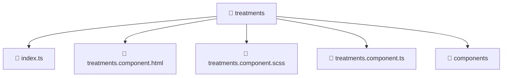

### 🧭 Breadcrumbs
[Root](/) > [frontend](/frontend) > [src](/frontend/src) > [pages](/frontend/src/pages) > [treatments](/frontend/src/pages/treatments)

# 📁 Treatments Directory
**Architecture Layer:** Page Layer

## 🎯 Purpose
Provides luxury professional architectural implementation for the treatments module within the Mavluda Beauty ecosystem. Ensure robust functionality and elegant integration with the broader architecture.

## 🏗️ ARCHITECTURE


## 📄 FILE REGISTRY
| File Name | Type | Responsibility | Key Aliases Used |
|---|---|---|---|
| `index.ts` | TypeScript | Provides core logic and orchestration for index.ts. | N/A |
| `treatments.component.html` | HTML Template | Structural template and layout for treatments.component.html. | N/A |
| `treatments.component.scss` | Stylesheet | Luxury styling and visual presentation for treatments.component.scss. | N/A |
| `treatments.component.ts` | TypeScript | UI component logic and state management for treatments.component.ts. | @angular/common, @angular/core, @entities/treatments, @entities/admin-settings, @shared/lib, @features/treatments, @environments/environment, @angular/forms, @shared/ui |

## 🔗 DEPENDENCIES
- `@angular/common`
- `@angular/core`
- `@angular/forms`
- `@entities/admin-settings`
- `@entities/treatments`
- `@environments/environment`
- `@features/treatments`
- `@shared/lib`
- `@shared/ui`

## 🛠️ USAGE
```typescript
// Example architectural integration for treatments
// Utilize the exported members according to Mavluda Beauty's standard conventions.
```

---
*Maintained by Mavluda Beauty - Architecture & Engineering*

---
*Maintained by Mavluda Beauty - Architecture & Engineering*