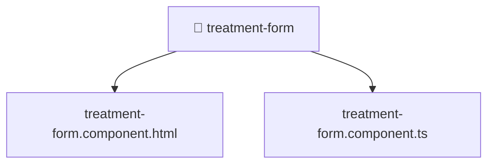

[🏠 Home](../../../../../../README.md) > [frontend](../../../../../README.md) > [src](../../../../README.md) > [pages](../../../README.md) > [treatments](../../README.md) > [components](../README.md) > [treatment-form](./README.md)

# 📁 treatment-form

**FSD Layer:** `Pages`

### 🎯 PURPOSE
Welcome to the exquisite **treatment-form** module of the Mavluda Beauty ecosystem. This directory focuses on orchestrating UI Components. It is designed adhering to our 'Luxury Professional' standards.

### 🏗️ ARCHITECTURE


### 📄 FILE REGISTRY
| File Name | Type | Responsibility | Key Aliases Used |
|---|---|---|---|
| `treatment-form.component.html` | HTML Template | Provides logic and definitions for treatment-form.component.html. | None |
| `treatment-form.component.ts` | Angular Component | Defines a UI component and its logic Defines classes: TreatmentFormComponent. | @features, @angular, @shared |

### 🔗 DEPENDENCIES
- `@angular/common`
- `@angular/forms`
- `@features/treatments`
- `@shared/lib`

### 🛠️ USAGE
```typescript
// Example interaction or integration snippet
// Import members from treatment-form based on module boundaries
```
