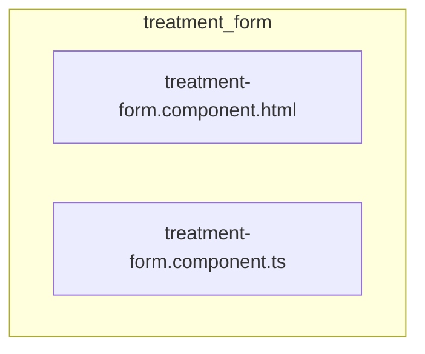

# 📁 treatment-form

[frontend](../../../../../README.md) > [src](../../../../README.md) > [pages](../../../README.md) > [treatments](../../README.md) > [components](../README.md) > [treatment-form](README.md)

---

### 🎯 PURPOSE
Elevating the digital experience for the Mavluda Beauty ecosystem, this module manages the sophisticated Pages Layer (Routing and page-level components) operations.

*FSD Layer:* **Pages Layer (Routing and page-level components)**

---

### 🏗️ ARCHITECTURE



---

### 📄 FILE REGISTRY
| File Name | Type | Responsibility | Key Aliases Used |
|-----------|------|----------------|------------------|
| `treatment-form.component.html` | Template | Handles template logic for Mavluda Beauty's luxury standards. | `None` |
| `treatment-form.component.ts` | Component | Handles component logic for Mavluda Beauty's luxury standards. | `@shared, @features, @angular` |

---

### 🔗 DEPENDENCIES
**Key Path Aliases Detected:** `@shared`, `@features`, `@angular`

Notable imports:
- `@angular/forms`
- `@angular/common`
- `@features/treatments`
- `@shared/lib`
- `@angular/core`

---

### 🛠️ USAGE
To interact with this directory's luxurious logic, integrate its exported components or services directly into your feature modules. Ensure strict adherence to the Pages Layer (Routing and page-level components) boundaries.

```typescript
// Example integration snippet
import { FeatureModule } from '@path/to/treatment-form';
```
