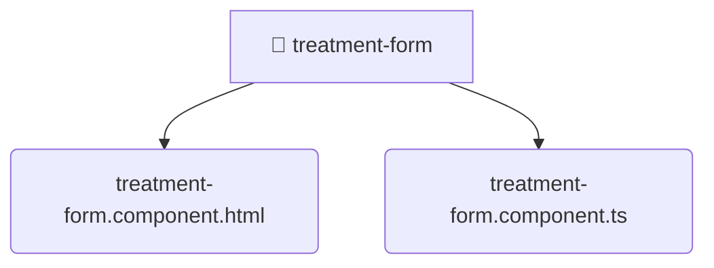

# [root](/) / [frontend](/frontend) / [src](/frontend/src) / [pages](/frontend/src/pages) / [treatments](/frontend/src/pages/treatments) / [components](/frontend/src/pages/treatments/components) / [treatment-form](/frontend/src/pages/treatments/components/treatment-form)

## 🏷️ 📁 Treatment-form

### 🎯 PURPOSE
The `treatment-form` directory forms a critical foundation within the Mavluda Beauty ecosystem, meticulously orchestrating the treatment-form logic to ensure a seamless and premium experience.

This directory resides within the **Pages** layer of our Feature Sliced Design (FSD) architecture, strictly adhering to Mavluda Beauty's robust separation of concerns.

### 🏗️ ARCHITECTURE


### 📄 FILE REGISTRY
| File Name | Type | Responsibility | Key Aliases Used |
|---|---|---|---|
| `treatment-form.component.html` | `html` | UI template and styling. | None |
| `treatment-form.component.ts` | `ts` | UI component logic and rendering. | @angular, @features, @shared |

### 🔗 DEPENDENCIES
- `@angular/common`
- `@angular/core`
- `@angular/forms`
- `@features/treatments`
- `@shared/lib`

### 🛠️ USAGE
```typescript
// Seamlessly integrate treatment-form into your refined workflows:
import { /* exported members */ } from '@path/to/treatment-form';
```
