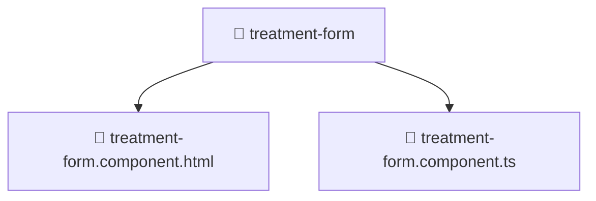

# 📁 Mavluda Beauty treatment-form

[frontend](/frontend) / [src](/frontend/src) / [pages](/frontend/src/pages) / [treatments](/frontend/src/pages/treatments) / [components](/frontend/src/pages/treatments/components) / [treatment-form](/frontend/src/pages/treatments/components/treatment-form)

## 🎯 Purpose
Delivering luxury-tier architectural components and high-performance logic for the **treatment-form** domain. This directory is a crucial part of the Mavluda Beauty full-stack ecosystem, ensuring seamless scalability, robust performance, and an elite digital experience.

> **FSD Layer**: `Pages` - Adhering to Feature Sliced Design principles.

## 🏗️ Architecture


## 📄 File Registry
| File Name | Type | Responsibility | Key Aliases Used |
|---|---|---|---|
| `treatment-form.component.html` | Component | Renders UI and handles user interaction. | N/A |
| `treatment-form.component.ts` | Component | Renders UI and handles user interaction. | `@angular/core, @angular/common, @angular/forms, @features/treatments, @shared/lib` |


## 🔗 Dependencies
**Path Aliases:**
- `@angular/core`
- `@angular/common`
- `@angular/forms`
- `@features/treatments`
- `@shared/lib`


## 🛠️ Usage
```typescript
// Example integration for treatment-form
// Import capabilities from this directory to enrich your modules.
```
> This directory provides specialized logic tailored to the Mavluda Beauty standard.
