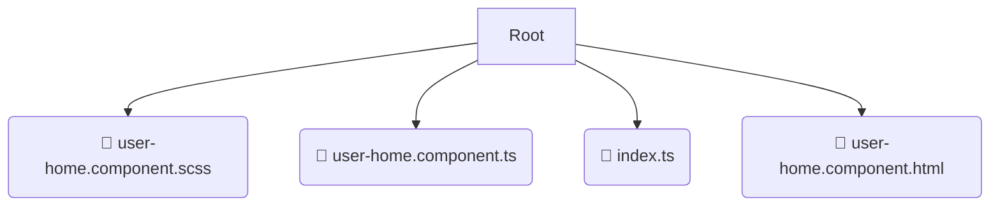

# 📂 user-home

*Breadcrumbs:* [frontend](/frontend) / [src](/frontend/src) / [pages](/frontend/src/pages) / [user-home](/frontend/src/pages/user-home)

## 🎯 PURPOSE
This directory `user-home` is an integral part of the Mavluda Beauty ecosystem. (FSD Layer: Pages) It composes features and widgets into routable page views.
This directory is meticulously maintained to uphold the 'Luxury Professional' standards of the Mavluda Beauty brand.

## 🏗️ ARCHITECTURE


## 📄 FILE REGISTRY
| File Name | Type | Responsibility | Key Aliases Used |
|---|---|---|---|
| `user-home.component.scss` | `scss` | Styling | `None` |
| `user-home.component.ts` | `ts` | UI Component logic | `@angular/router, @angular/common/http, @core/constants...` |
| `index.ts` | `ts` | Core functionality | `None` |
| `user-home.component.html` | `html` | UI Template | `None` |

## 🔗 DEPENDENCIES
- `@angular/router`
- `@angular/common/http`
- `@core/constants`
- `@angular/common`
- `@angular/core`

## 🛠️ USAGE
```typescript
// Example placeholder for interacting with the user-home module
import { example } from './user-home.component.scss';
```
