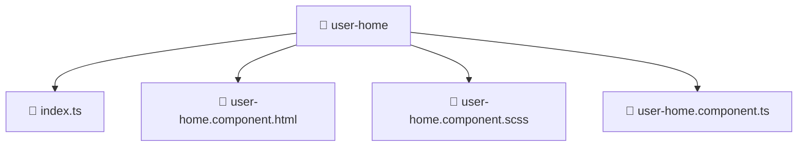

# 📁 user-home

[Root](/.) > [frontend](/frontend) > [src](/frontend/src) > [pages](/frontend/src/pages) > [user-home](/frontend/src/pages/user-home)

## 🎯 Purpose
Delivering luxury-tier architectural components and high-performance logic for the **user-home** domain. This directory is a crucial part of the Mavluda Beauty full-stack ecosystem, ensuring seamless scalability, robust performance, and an elite digital experience.

## 🏗️ Architecture


## 📄 File Registry
| File Name | Type | Responsibility | Key Aliases Used |
|---|---|---|---|
| `index.ts` | TypeScript | Handles logic and definitions for index.ts | None |
| `user-home.component.html` | HTML | Handles logic and definitions for user-home.component.html | None |
| `user-home.component.scss` | SCSS | Handles logic and definitions for user-home.component.scss | None |
| `user-home.component.ts` | TypeScript | Handles logic and definitions for user-home.component.ts | @angular/common, @angular/common/http, @angular/router, @core/constants |

## 🔗 Dependencies
- `@angular/common`
- `@angular/common/http`
- `@angular/router`
- `@core/constants`

## 🛠️ Usage
```typescript
// Example usage within the Mavluda Beauty ecosystem
import { relevantMember } from './user-home';

// Integrate into the application architecture
relevantMember.execute();
```
