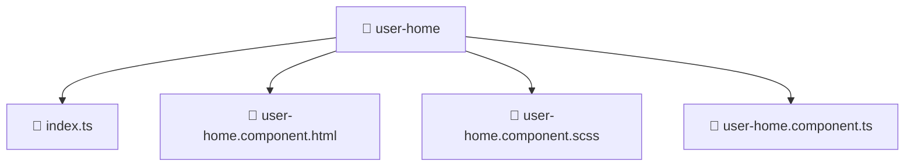

# 📁 user-home

[Root](/.) > [frontend](/frontend) > [src](/frontend/src) > [pages](/frontend/src/pages) > [user-home](/frontend/src/pages/user-home)

## 🎯 Purpose
Delivering luxury-tier architectural components and high-performance logic for the **user-home** domain. This directory is a crucial part of the Mavluda Beauty full-stack ecosystem, ensuring seamless scalability, robust performance, and an elite digital experience.
> **FSD Layer:** Pages - Adhering to strict Feature Sliced Design architectural constraints.

## 🏗️ Architecture


## 📄 File Registry
| File Name | Type | Responsibility | Key Aliases Used |
|---|---|---|---|
| `index.ts` | File | Core logic and utilities for this domain. | N/A |
| `user-home.component.html` | Template | Visual layout and structural HTML. | N/A |
| `user-home.component.scss` | Stylesheet | Luxury styling and layout logic. | N/A |
| `user-home.component.ts` | Component | UI rendering and component-level state. | @angular, @core |


## 🔗 Dependencies
- `./user-home.component`
- `@angular/core`
- `@angular/common`
- `@angular/router`
- `@angular/common/http`
- `@core/constants`

## 🛠️ Usage
```typescript
// Example usage within the Mavluda Beauty ecosystem
import { relevantMember } from './index';

// Integrate into the application architecture
relevantMember.execute();
```
