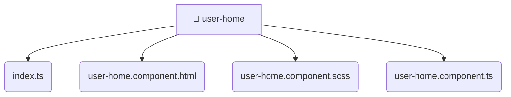

# [root](/) / [frontend](/frontend) / [src](/frontend/src) / [pages](/frontend/src/pages) / [user-home](/frontend/src/pages/user-home)

## 🏷️ 📁 User-home (Page Layer)

### 🎯 PURPOSE
The `user-home` page component orchestrates the UI layer for the user-home feature in the Mavluda Beauty frontend application.

### 🏗️ ARCHITECTURE


### 📄 FILE REGISTRY
| File Name | Type | Responsibility | Key Aliases Used |
|---|---|---|---|
| `index.ts` | `ts` | Core logic implementation. | None |
| `user-home.component.html` | `html` | UI template and styling. | None |
| `user-home.component.scss` | `scss` | UI template and styling. | None |
| `user-home.component.ts` | `ts` | UI component logic and rendering. | @angular, @core |

### 🔗 DEPENDENCIES
- `./user-home.component`
- `@angular/common`
- `@angular/common/http`
- `@angular/core`
- `@angular/router`
- `@core/constants`

### 🛠️ USAGE
```typescript
// Seamlessly integrate user-home into your refined workflows:
import { /* exported members */ } from '@path/to/user-home';
```
