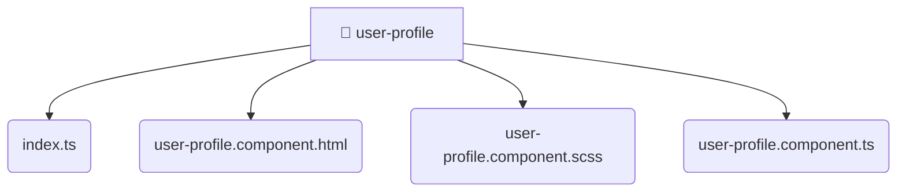

# [root](/) / [frontend](/frontend) / [src](/frontend/src) / [pages](/frontend/src/pages) / [user-profile](/frontend/src/pages/user-profile)

## 🏷️ 📁 User-profile

### 🎯 PURPOSE
The `user-profile` directory forms a critical foundation within the Mavluda Beauty ecosystem, meticulously orchestrating the user-profile logic to ensure a seamless and premium experience.

This directory resides within the **Pages** layer of our Feature Sliced Design (FSD) architecture, strictly adhering to Mavluda Beauty's robust separation of concerns.

### 🏗️ ARCHITECTURE


### 📄 FILE REGISTRY
| File Name | Type | Responsibility | Key Aliases Used |
|---|---|---|---|
| `index.ts` | `ts` | Core logic implementation. | None |
| `user-profile.component.html` | `html` | UI template and styling. | None |
| `user-profile.component.scss` | `scss` | UI template and styling. | None |
| `user-profile.component.ts` | `ts` | UI component logic and rendering. | @angular, @entities |

### 🔗 DEPENDENCIES
- `./user-profile.component`
- `@angular/common`
- `@angular/core`
- `@entities/user`

### 🛠️ USAGE
```typescript
// Seamlessly integrate user-profile into your refined workflows:
import { /* exported members */ } from '@path/to/user-profile';
```
