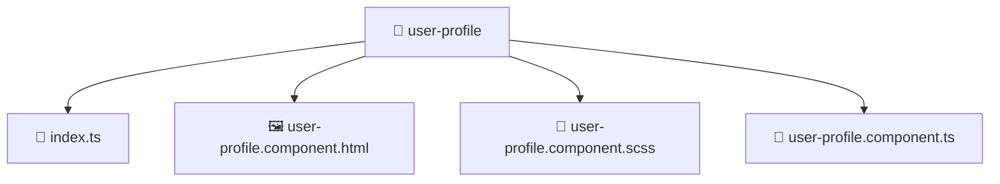

# 📁 user-profile

[Root](/../../../../README.md) / [frontend](../../../README.md) / [src](../../README.md) / [pages](../README.md) / [user-profile](./README.md)

## 🎯 Purpose
Delivering luxury-tier architectural components and high-performance logic for the **user-profile** domain. This directory is a crucial part of the Mavluda Beauty full-stack ecosystem, ensuring seamless scalability, robust performance, and an elite digital experience.

**FSD Layer:** Pages

## 🏗️ Architecture


## 📄 File Registry
| File Name | Type | Responsibility | Key Aliases Used |
|---|---|---|---|
| `index.ts` | TypeScript | Provides core logic and orchestration for index.ts. | N/A |
| `user-profile.component.html` | Template | Structural template and layout for user-profile.component.html. | N/A |
| `user-profile.component.scss` | Stylesheet | Luxury styling and visual presentation for user-profile.component.scss. | N/A |
| `user-profile.component.ts` | Component | UI component logic and state management for user-profile.component.ts. | @angular, @entities |


## 🔗 Dependencies
**Internal / Aliases:**
- `@angular/common`
- `@angular/forms`
- `@entities/user`


## 🛠️ Usage
```typescript
// Example usage within the Mavluda Beauty ecosystem
import { relevantMember } from './index';

// Integrate into the application architecture
relevantMember.execute();
```
