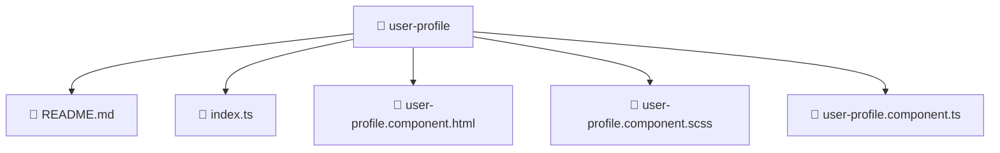

# 📁 user-profile

[Root](/.) > [frontend](/frontend) > [src](/frontend/src) > [pages](/frontend/src/pages) > [user-profile](/frontend/src/pages/user-profile)

## 🎯 Purpose
Delivering luxury-tier architectural components and high-performance logic for the **user-profile** domain. This directory is a crucial part of the Mavluda Beauty full-stack ecosystem, ensuring seamless scalability, robust performance, and an elite digital experience.

💎 **FSD Layer:** This directory represents the **Pages** layer in the Feature Sliced Design (FSD) architecture, strictly adhering to its modular principles.

## 🏗️ Architecture


## 📄 File Registry
| File Name | Type | Responsibility | Key Aliases Used |
|---|---|---|---|
| `README.md` | Markdown | Provides core logic and configuration for README.md. | N/A |
| `index.ts` | TypeScript | Provides core logic and orchestration for index.ts. | N/A |
| `user-profile.component.html` | Template | Structural template and layout for user-profile.component.html. | N/A |
| `user-profile.component.scss` | Stylesheet | Luxury styling and visual presentation for user-profile.component.scss. | N/A |
| `user-profile.component.ts` | TypeScript | UI component logic and state management for user-profile.component.ts. | @angular, @entities |

## 🔗 Dependencies
- `./user-profile`
- `./user-profile.component`
- `@angular/common`
- `@angular/core`
- `@angular/forms`
- `@entities/user`

## 🛠️ Usage
```typescript
// Example usage within the Mavluda Beauty ecosystem
import { relevantMember } from './user-profile';

// Integrate into the application architecture
relevantMember.execute();
```
