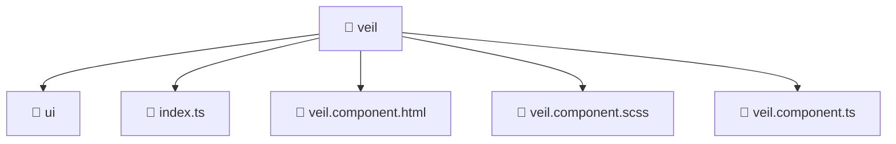

# 📁 Mavluda Beauty veil

[frontend](/frontend) / [src](/frontend/src) / [pages](/frontend/src/pages) / [veil](/frontend/src/pages/veil)

## 🎯 Purpose
Delivering luxury-tier architectural components and high-performance logic for the **veil** domain. This directory is a crucial part of the Mavluda Beauty full-stack ecosystem, ensuring seamless scalability, robust performance, and an elite digital experience.

> **FSD Layer**: `Pages` - Adhering to Feature Sliced Design principles.

## 🏗️ Architecture


## 📄 File Registry
| File Name | Type | Responsibility | Key Aliases Used |
|---|---|---|---|
| `index.ts` | TypeScript Logic | Core logic and utilities for this domain. | N/A |
| `veil.component.html` | Component | Renders UI and handles user interaction. | N/A |
| `veil.component.scss` | Component | Renders UI and handles user interaction. | N/A |
| `veil.component.ts` | Component | Renders UI and handles user interaction. | `@angular/common, @angular/core, @environments/environment, @entities/veil, @entities/admin-settings, @features/veil, @shared/lib, @shared/ui` |


## 🔗 Dependencies
**Path Aliases:**
- `@angular/common`
- `@angular/core`
- `@environments/environment`
- `@entities/veil`
- `@entities/admin-settings`
- `@features/veil`
- `@shared/lib`
- `@shared/ui`

**External Packages:**
- `rxjs`


## 🛠️ Usage
```typescript
// Example integration for veil
// Import capabilities from this directory to enrich your modules.
```
> This directory provides specialized logic tailored to the Mavluda Beauty standard.
