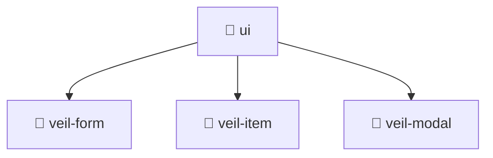

# 📁 ui

[Root](/.) > [frontend](/frontend) > [src](/frontend/src) > [pages](/frontend/src/pages) > [veil](/frontend/src/pages/veil) > [ui](/frontend/src/pages/veil/ui)

**FSD Layer:** Page

## 🎯 Purpose
Delivering luxury-tier architectural components and logic for the **ui** domain. Ensuring seamless scalability, robust performance, and an elite digital experience in the Mavluda Beauty ecosystem.

## 🏗️ Architecture

## 📄 File Registry
| File Name | Type | Responsibility | Key Aliases Used |
|---|---|---|---|

## 🔗 Dependencies
- No external dependencies.

## 🛠️ Usage
> No specific code execution examples for this directory.
