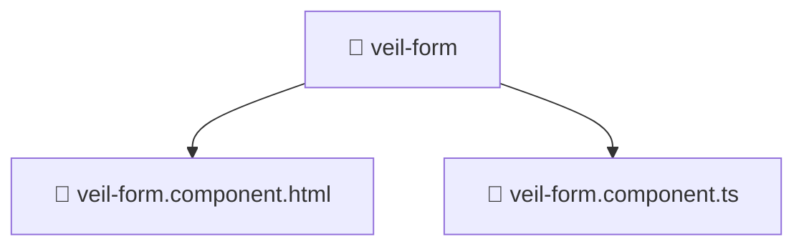

# 📁 veil-form

[Root](/.) > [frontend](/frontend) > [src](/frontend/src) > [pages](/frontend/src/pages) > [veil](/frontend/src/pages/veil) > [ui](/frontend/src/pages/veil/ui) > [veil-form](/frontend/src/pages/veil/ui/veil-form)

**FSD Layer:** Page

## 🎯 Purpose
Delivering luxury-tier architectural components and high-performance logic for the **Veil Form** domain. This directory is a crucial part of the Mavluda Beauty full-stack ecosystem, ensuring seamless scalability, robust performance, and an elite digital experience.

**Architecture Layer:** Pages (Feature Sliced Design / Layered Architecture)

## 🏗️ Architecture


## 📄 File Registry
| File Name | Type | Responsibility | Key Aliases Used |
|---|---|---|---|
| `veil-form.component.html` | Template | Core logic and utilities for this domain. | N/A |
| `veil-form.component.ts` | TypeScript | Core logic and utilities for this domain. | @angular, @shared |

## 🔗 Dependencies
- `@angular/common`
- `@angular/forms/signals`
- `@shared/lib`

## 🛠️ Usage
```markdown
```markdown
> This directory acts primarily as a structural container or logic module.
> To interact with its contents, import the relevant exported members from the `index.ts` or specifically targeted files.
```
```
