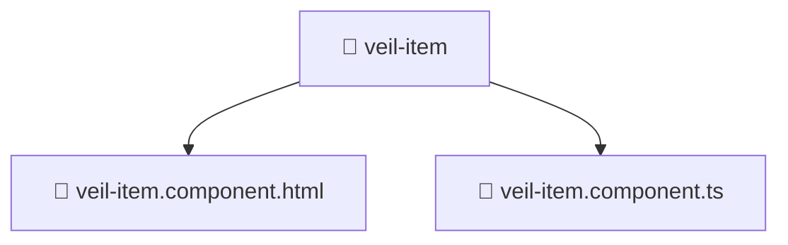

<!--
Mavluda Beauty - Luxury Professional Documentation
Generated for 100% Architectural Transparency
-->
[Home](../../../../../../README.md) > [frontend](../../../../../README.md) > [src](../../../../README.md) > [pages](../../../README.md) > [veil](../../README.md) > [ui](../README.md) > [veil-item](./README.md)

# 👰 VEIL-ITEM Directory

> **FSD Layer:** Pages

## 🎯 PURPOSE
Represents full application views and routes orchestrating widgets and features.

## 🏗️ ARCHITECTURE


## 📄 FILE REGISTRY
| File Name | Type | Responsibility | Key Aliases Used |
|---|---|---|---|
| `veil-item.component.html` | HTML Template | UI rendering and component logic. | - |
| `veil-item.component.ts` | TypeScript | UI rendering and component logic. | @angular, @features |


## 🔗 DEPENDENCIES
- `@angular/core`
- `@angular/common`
- `@features/veil`

## 🛠️ USAGE
```typescript
// Example placeholder for interacting with veil-item
// Consult the individual files in the registry for specific APIs.
```
